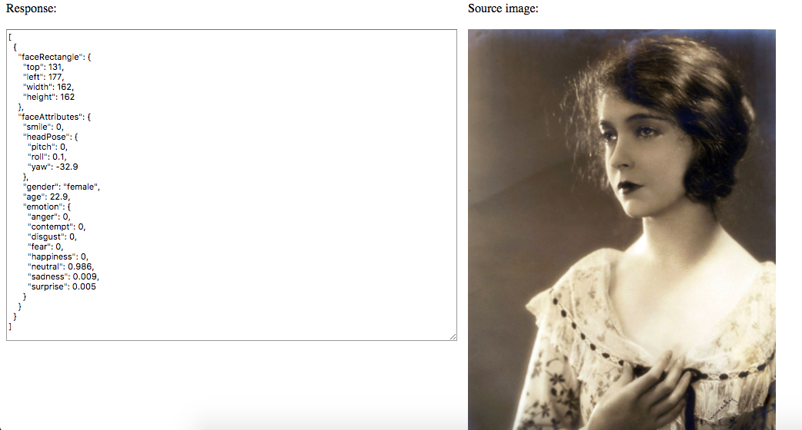

# Face2Face

Facial recognition software to detect during an interview or interrogation if someone is lying.

## Facial Recognition

Through Microsoft Azure's Facial Recognition API (https://azure.microsoft.com/en-us/services/cognitive-services/face/), we  were able to display emotions, facial landmarks, face attributes, and many more characteristics given through the algorithm. Through the data we collected, we then parse through the data and run it through an algorithm we created to determine if the interviewee or the interrogatee are telling the truth or not.

## Video Slicing

Using @ilkkao's capture-video-frame micro-library (https://github.com/ilkkao/capture-video-frame) we were able to take slices of video and split them into frames or individual "pictures" to be evaluated and so we can run them through our algorithm.

Once we have a bunch of these frames, we then individually parse through each picture and determine if there is significant information to determine if the interviewee is telling the truth. Through each frame, we will then send the information to the user so they can see results in live time.

## Lie-Detector Algorithm

Unfortunately, we did not get to the actual algorithm that would parse through the images.
